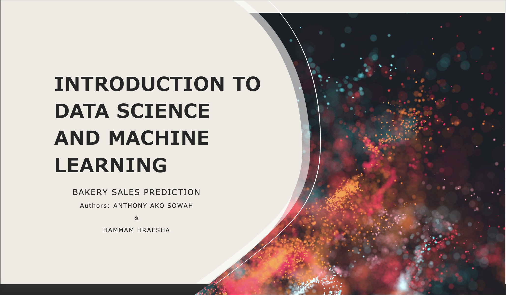

# Bakery Sales Prediction

## Repository Link

https://github.com/Godfaada/Bakery_Sales_Prediction

## Description

We predict sales for six product categories of a bakery branch located somewhere in Kiel. The training data includes dates, Product categories, and sales numbers. Additional files include supplementary information that may be useful in building your models.

### Task Type

Regression

### Results Summary

- **Best Model:** Convolutional Neural Network
- **Evaluation Metric:** MAPE
- **Result by Category** (Identifier):
    -   **Bread** (1): 0.197225%
    -   **Rolls** (2): 0.163807%
    -   **Croissant** (3): 0.192119%
    -   **Confectionery** (4): 0.220140%
    -   **Cake** (5): 0.149874%
    -   **Seasonal Bread** (6): 0.473475%

## Documentation

1. **[Dataset Characteristics](1_DatasetCharacteristics/exploratory_data_analysis.ipynb)**
2. **[Baseline Model](2_BaselineModel/baseline_model.ipynb)**
3. **[Model Definition and Evaluation](3_Model/model_definition_evaluation)**
4. **[Presentation](4_Presentation/README.md)**

## Cover Image

