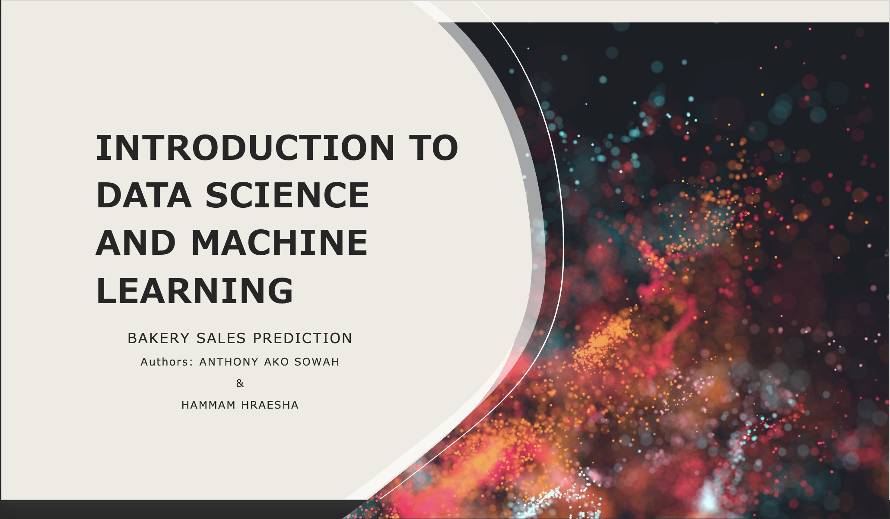

# Sales Forecasting for a Bakery Branch

## Repository Link

https://github.com/Godfaada/Bakery_Sales_Prediction

## Description

This project focuses on sales forecasting for a bakery branch, utilizing historical sales data spanning from July 1, 2013, to July 30, 2018, to inform inventory and staffing decisions. We aim to predict future sales for six specific product categories: Bread, Rolls, Croissants, Confectionery, Cakes, and Seasonal Bread. Our methodology integrates statistical and machine learning techniques, beginning with a baseline linear regression model to identify fundamental trends, and progressing to a sophisticated neural network designed to discern more nuanced patterns and enhance forecast precision. The initiative encompasses data preparation, crafting bar charts with confidence intervals for visualization, and fine-tuning models to assess their performance on test data from August 1, 2018, to July 30, 2019, using the Mean Absolute Percentage Error (MAPE) metric for each product category.

### Task Type

Regression

### Results Summary

-   **Best Model:** Convolutional Neural Network
-   **Evaluation Metric:** MAPE
-   **Result by Category** (Identifier):
    -   **Bread** (1): 0.195878%
    -   **Rolls** (2): 0.164488%
    -   **Croissant** (3): 0.194171%
    -   **Confectionery** (4): 0.215767%
    -   **Cake** (5): 0.148250%
    -   **Seasonal Bread** (6): 0.476020%

## Cover Image

